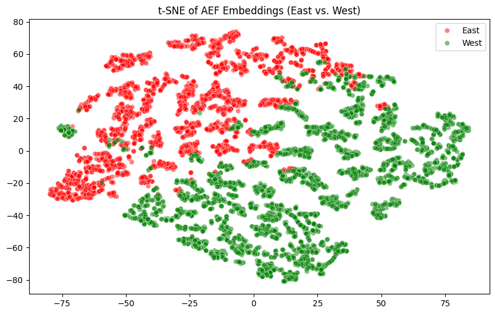

# Exploring Out-of-Domain Generalisation of AlphaEarth embeddings for crop yield prediction

This project explored the effect of reducing the dimensionality of AlphaEarth embeddings on the transferability of crop yield prediction models, inspired by the finding of Ma _et al._ (2026) that models trained on the full 64-dimensional feature set exhibit significant performance degradation under performance transfer across the US Corn Belt.[1] 

## Data and Baselines

### Study Area

Using the embedding data provided by the authors ([2]), the geographic split used by Ma _et al._ -- into the Great Plains and Eastern Temperate Forests ecoregions -- is replicated using the EPA Level I ecoregion boundaries.

| Region                     | Observations      | Mean Yield (t/ha) |
|---------------------------|-------------------|-------------------|
| Eastern Temperate Forests | 2,608 county-year | 12.13             |
| Great Plains              | 3,459 county-year | 10.83             |

  

### Baselines 

Before evaluating transfer experiments, the in-domain performances are determined using a Random Forest classifier under leave-one-year-out (LOYO) cross validation. The model yields average in-domain $R^2$ of 0.774 and 0.657 for Great Plains and Eastern Temperate Forests, respectively. The LOYO results are displayed below.

| Year | GP R² | GP RMSE | ETF R² | ETF RMSE |
|:----:|:-----:|:-------:|:------:|:--------:|
| 2017 | 0.862 | 1.021   | 0.718  | 0.839    |
| 2018 | 0.707 | 1.457   | 0.708  | 1.043    |
| 2019 | 0.809 | 1.020   | 0.492  | 1.018    |
| 2020 | 0.752 | 1.210   | 0.688  | 0.852    |
| 2021 | 0.809 | 1.468   | 0.584  | 1.024    |
| 2022 | 0.781 | 1.519   | 0.709  | 0.911    |
| 2023 | 0.782 | 1.309   | 0.717  | 0.995    |
| 2024 | 0.687 | 1.507   | 0.644  | 1.132    |

The transfer results with full dimensionality are then evaluated. Similar performance degradation to Ma _et al._ is observed.

| Transfer Direction | Target R² | Target RMSE |
|-------------------|-----------|-------------|
| ETF → GP          | -0.0894   | 2.8677      |
| GP → ETF          | 0.4976    | 1.1433      |

## Methods

### Quantifying Domain Shift

Before attempting dimensionality reduction, the degree of domain shift in the AEF embedding space was analysed. We train a logistic classifier on the 64-dimensional AEF embeddings; this achieved accuracy of 0.95 in discerning ETF from GP counties. This suggests strong geographic structure in the embedding space, as visualised by the tSNE plot below.

  

Feature instability was then analysed by computing per-dimension correlations with yield for each region, before ranking dimensions by correlation difference, permutation importance shift, Wasserstein distance between domain distributions, and sign flips in yield correlation direction. The results for the five least stable features across the transfer gradient are detailed below. In general, there appears to be significant variation between locations in the most predictive bands/features of yield.

  
| Feature | Imp (ETF) | Imp (GP) | Corr (ETF) | Corr (GP) | Corr Diff | Imp Diff | Sign Flip |
|:--------|:---------:|:--------:|:----------:|:---------:|:---------:|:--------:|:---------:|
| A20     | 0.002553  | 0.022860 | -0.422578  | 0.529961  | 0.952539  | 0.020307 | True      |
| A55     | 0.007588  | 0.008343 | -0.233398  | 0.633708  | 0.867106  | 0.000755 | True      |
| A56     | 0.008993  | 0.004545 | -0.366523  | 0.459605  | 0.826129  | 0.004448 | True      |
| A41     | 0.004524  | 0.005940 | -0.267620  | 0.432698  | 0.700318  | 0.001415 | True      |
| A39     | 0.003153  | 0.002705 | -0.426229  | 0.261746  | 0.687975  | 0.000447 | True      |

### Dimensionality Reduction and Domain-Adversarial Approaches

Five dimensionality reduction techniques were tested, each sweeping k ∈ {2,4,8,12,16,24,32,42,64}, alongside three neural domain-adversarial approaches. 

| ID  | Method                          | Type                      | Description |
|:----|:--------------------------------|:--------------------------|:------------|
| (a) | LASSO-based selection           | Feature Selection         | Dimensions ranked by absolute coefficient magnitude from LassoCV fitted on source domain |
| (b) | Stability-based selection       | Feature Selection         | Dimensions ranked by smallest cross-domain correlation difference (Corr_Diff), selecting features most consistent across domains |
| (c) | Domain-discriminability removal | Feature Selection         | Dimensions ranked by least contribution to domain classification (logistic regression), removing geographically identifying features |
| (d) | Transfer Component Analysis     | Subspace Method           | Kernel PCA applied jointly to source and target embeddings to learn a shared low-dimensional subspace |
| (e) | Universal Generalist Subspace   | Feature Selection         | Features with positive permutation importance in both ETF→GP and GP→ETF transfers (16 identified) |
| (f) | PDANN                          | Domain Adaptation (NN)    | Partial domain-adversarial neural network with gradient reversal and Gaussian likelihood weighting |
| (g) | Disentangled PDANN             | Domain Adaptation (NN)    | Separate shared/private encoders with orthogonality loss to remove geographic information |
| (h) | DSBN-PDANN                     | Domain Adaptation (NN)    | Domain-specific batch normalization combined with adversarial training |

## Results and Discussion

| Method | Best ETF→GP R² | Best k | Notes |
|--------|---------------|--------|-------|
| Raw AEF (baseline) | −0.09 | 64 | — |
| LASSO selection | 0.164 | 4 | Inconsistent across k |
| **Stability-based selection** | **0.302** | **32** | Most consistent improvement |
| Domain-discriminability removal | 0.219 | 12 | Inconsistent |
| TCA | 0.167 | 4 | Diminishing returns with k |
| PDANN | 0.070 | — | Marginal improvement |
| Disentangled PDANN | −0.414 | — | Worse than baseline |
| DSBN-PDANN | −0.264 | — | Worse than baseline |

Stability-based selection — selecting dimensions with the most consistent correlations with yield across domains — was the most effective post-hoc approach, improving ETF→GP transfer from $R^2 = −0.09$
to $R^2 = 0.30$. However, all post-hoc approaches showed limited and inconsistent gains, and neural domain adaptation approaches largely failed to improve over baseline. This suggests that if region-specific 
signals constrain transferability, they are not cleanly separable from agriculturally meaningful ones post-hoc. Indeed, even the 16 dimensions of the "Universal Generalist" subspace retained domain discriminability of 0.93 under application of a logistic regression classifier, indicating that region-specific signals are entangled throughout the embedding space rather than isolated to specific dimensions.

[1] Ma, Y., Shen, Y., Swatantran, A. and Lobell, D.B. (2026) 'Harvesting AlphaEarth: benchmarking the geospatial foundation model for agricultural downstream tasks', International Journal of Applied Earth Observation and Geoinformation, 149, p. 105258. doi: 10.1016/j.jag.2026.105258.\\

[2] Ma, Y., Shen, Y., Swatantran, A. and Lobell, D.B. (2026) Harvest_AlphaEarth. Available at: https://github.com/yuchima8/Harvest_AlphaEarth (Accessed: 6 May 2026).
